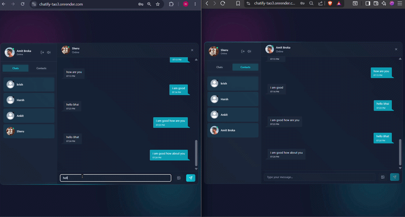
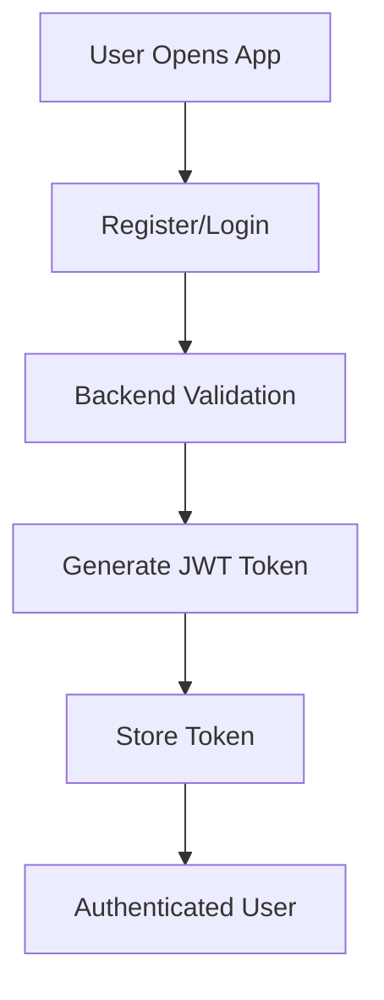
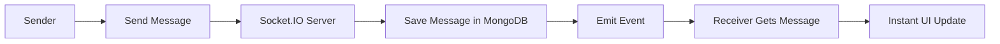
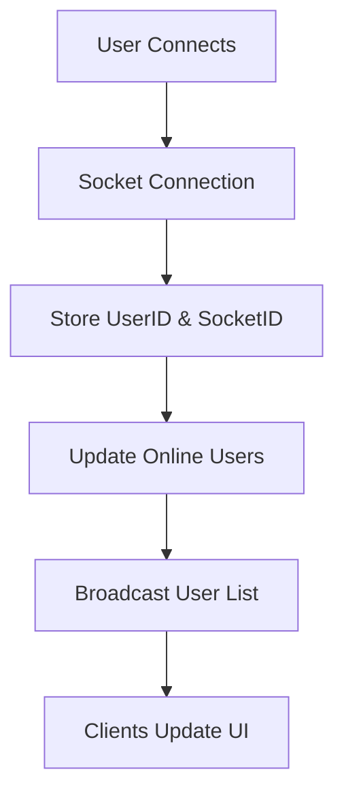
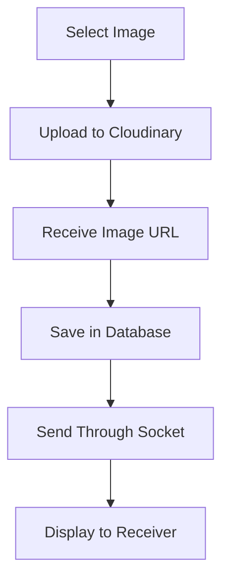

# 💬 Chatify

### Modern Real-Time Messaging Platform Built with MERN & Socket.IO

**Instant Messaging • Real-Time Updates • Secure Authentication • Modern UI**

---

# ✨ Overview

Chatify is a full-stack real-time chat application that enables users to communicate instantly through a modern and responsive interface.

Built using the **MERN Stack** and **Socket.IO**, Chatify delivers seamless messaging, online user tracking, image sharing, and real-time notifications.

---

## 🎥 Demo



# 🚀 Features

## 🔐 Authentication & Security

* User Registration
* User Login
* JWT Authentication
* Protected Routes
* Secure Password Hashing
* Persistent Login Sessions

## 💬 Real-Time Messaging

* Instant Message Delivery
* Live Chat Updates
* Socket.IO Integration
* Message Synchronization
* Real-Time Event Handling

## 👥 User Management

* View All Contacts
* Online / Offline Status
* Active User Tracking
* User Profile Support

## 🖼 Media Sharing

* Image Upload Support
* Cloud Storage Integration
* Image Preview
* Chat Media History

## 🔔 Notifications

* Sound Notifications
* New Message Alerts
* Real-Time Updates

## 📱 Responsive UI

* Modern Chat Layout
* Clean User Experience
* Optimized Performance

---

# 🛠 Tech Stack

## Frontend

| Technology   | Purpose          |
| ------------ | ---------------- |
| React.js     | UI Development   |
| Zustand      | State Management |
| Axios        | API Requests     |
| React Router | Navigation       |
| Tailwind CSS | Styling          |

## Backend

| Technology | Purpose   |
| ---------- | --------- |
| Node.js    | Runtime   |
| Express.js | REST APIs |
| MongoDB    | Database  |
| Mongoose   | ODM       |

## Real-Time Communication

| Technology | Purpose                 |
| ---------- | ----------------------- |
| Socket.IO  | WebSocket Communication |

## Authentication

| Technology | Purpose          |
| ---------- | ---------------- |
| JWT        | Authentication   |
| bcrypt     | Password Hashing |

---

# 🏗 System Architecture

```text
┌─────────────────┐
│     Client      │
│  React + Vite   │
└────────┬────────┘
         │
         ▼
┌─────────────────┐
│  Express Server │
│  REST + Socket  │
└───────┬─────────┘
        │
 ┌──────┴──────┐
 ▼             ▼
MongoDB     Socket.IO
Database      Server
```

---

# 🔄 Application Workflow

## User Authentication Flow



---

## Real-Time Messaging Flow



---

## Online User Tracking Flow



---

## Image Sharing Flow



---

# 📂 Project Structure

```bash
Chatify
│
├── frontend
│   ├── src
│   │   ├── components
│   │   ├── pages
│   │   ├── store
│   │   ├── hooks
│   │   ├── lib
│   │   └── App.jsx
│   │
│   └── package.json
│
├── backend
│   ├── controllers
│   ├── routes
│   ├── middleware
│   ├── models
│   ├── socket
│   ├── utils
│   └── server.js
│
├── screenshots
│
└── README.md
```

---

# 📊 Database Design

```text
User
 ├─ _id
 ├─ fullName
 ├─ email
 ├─ password
 ├─ profilePic
 └─ createdAt

Message
 ├─ _id
 ├─ senderId
 ├─ receiverId
 ├─ text
 ├─ image
 └─ createdAt
```

---

# ⚙️ Environment Variables

Create a `.env` file inside backend folder:

```env
PORT=5001

MONGODB_URI=your_mongodb_uri

JWT_SECRET=your_jwt_secret

CLOUDINARY_CLOUD_NAME=your_cloud_name
CLOUDINARY_API_KEY=your_api_key
CLOUDINARY_API_SECRET=your_api_secret

NODE_ENV=development
```

---

# 🚀 Installation

### Clone Repository

```bash
git clone https://github.com/anuragbhati01/Chatify.git
cd Chatify
```

### Install Backend Dependencies

```bash
cd backend
npm install
```

### Install Frontend Dependencies

```bash
cd frontend
npm install
```

### Run Backend

```bash
npm run dev
```

### Run Frontend

```bash
npm run dev
```

---

# 📸 Screenshots

## Login Page

```md

```

## Chat Interface

```md

```

## Profile Page

```md

```

---

# 🔥 Socket.IO Event Lifecycle

```text
User Sends Message
        │
        ▼
socket.emit("sendMessage")
        │
        ▼
Server Receives Event
        │
        ▼
Store in Database
        │
        ▼
io.to(receiverSocketId).emit()
        │
        ▼
Receiver Instantly Updates UI
```

---

# ⭐ Show Your Support

If you like this project:

⭐ Star the repository

🍴 Fork the project

📢 Share it with others

---

# 👨‍💻 Author

**Anurag Bhati**

GitHub: https://github.com/anuragbhati01

---

<div align="center">

### Made with ❤️ using MERN Stack & Socket.IO

</div>
